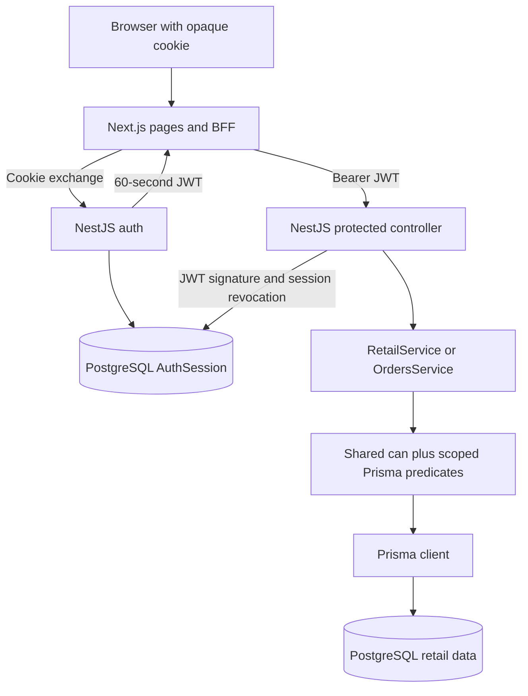

# Architecture and principles

[Documentation index](README.md)

## Workspace map

The [root manifest](../package.json) defines npm workspaces under `apps/*` and `packages/*`; [Turbo](../turbo.json) coordinates tasks and builds dependency packages before consumers where configured.

- `apps/web`: Next.js 16 App Router and React 19. Owns pages, interactive dashboard, fetch execution, and TanStack Query state.
- `apps/api`: NestJS 11. Owns authentication, request validation, permission/resource checks, retail transactions, and error responses.
- `apps/db`: PostgreSQL 16 Docker Compose service for local development.
- `packages/prisma`: Prisma 7 schema, SQL migrations, seed, generated client integration, and PostgreSQL adapter/pool.
- `packages/authorization`: shared runtime-independent permission vocabulary, `can()` policy, and server-used JWT format/signature functions.
- `packages/api-client`: typed endpoint descriptors and serialized response interfaces. It does not perform fetches or depend on React/Next.js runtime APIs. It has a Prisma package dependency for shared model types.
- `packages/ui`: shared UI components and form primitives. The dashboard reuses the shared Button; its operational forms use native FormData.
- `packages/design-system`, `packages/icons`: common presentation assets and styling infrastructure.
- `packages/eslint-config`, `packages/jest-config`, `packages/typescript-config`: shared tooling configuration.

The package manifest and API root response still contain template-era names. Product branding is Branch & Co. Package metadata is not a reliable inventory of implemented retail routes.

## Runtime flow

Endpoint descriptors in `@repo/api-client` describe method, URL, optional body, and inferred response type. The web application's client and server fetch helpers execute those descriptors through the same-origin BFF. This preserves the template's separation between contracts and transport.

On protected browser requests, Next exchanges the opaque session for a short-lived JWT, verifies it, and checks shared `can()`. Nest independently verifies that JWT and its database session, then controllers/services recheck permissions and put tenant/region/store conditions into database queries. See the [BFF architecture guide](12-bff-authentication-architecture.md). DTO validation is registered globally in [main.ts](../apps/api/src/main.ts). Depending on Nest's request lifecycle, invalid DTOs may fail before controller authentication; do not treat a validation response as proof that a caller is authenticated.

Authentication is not a global guard. The inherited Links routes remain public in Nest and are publicly proxied by the BFF. New controllers must deliberately apply the appropriate protection.

## Sources of truth

1. **Database structure:** [Prisma schema](../packages/prisma/prisma/schema.prisma) plus [SQL migrations](../packages/prisma/prisma/migrations). Several CHECK constraints exist only in SQL.
2. **Current identity and grants:** User, Role, Permission, RolePermission, UserStore, and AuthSession rows, loaded at each BFF token exchange. The JWT is the short-lived authorization snapshot; Nest also rechecks session revocation on each protected request.
3. **Current stock and branch price:** StoreProduct. InventoryMovement explains changes but is not replayed to compute stock on each request.
4. **Historical receipt:** OrderItem's price and product-name snapshots, with Order.total computed on the server.
5. **Refund eligibility:** [refund.policy.ts](../apps/api/src/orders/refund.policy.ts), reused by capabilities and the conditional write.
6. **Shared permission checks:** [the authorization package](../packages/authorization/src/policy.ts) defines `can()` for role grant and optional tenant/store membership.
7. **Transport contracts:** `packages/api-client` interfaces and endpoint descriptors. These are handwritten TypeScript contracts, not generated runtime validators.
8. **UI state:** TanStack Query stores server snapshots; component state stores branch selection, forms, search, and the demonstration override.

## Why the design works this way

### Normalize shared facts; snapshot historical facts

Product stores reusable catalog identity. StoreProduct stores local price and stock because those facts vary by branch. RolePermission and UserStore represent many-to-many relationships with composite keys. User has one role to preserve the starter's model.

OrderItem intentionally duplicates the product name and price charged. A receipt should still describe what was sold after the catalog changes. This duplication has a different purpose from accidentally maintaining two current prices.

### Authorize the operation and the resource

Shared `can()` checks a permission such as `order.refund` and optional tenant/store attributes. This answers whether an actor may perform that kind of operation within a named scope. It does not answer whether a particular order belongs to their tenant, region, branch, or limit. Scoped SQL predicates add those conditions. HQ uses the same scoping mechanism as other staff.

### Enforce mutable conditions at the write

A successful read can become stale before a write. Stock decrement includes `stock >= quantity`; status changes include the previously read status; refunds include PAID status and the limit in the update predicate. This makes competing changes observable through the affected-row count.

### Commit related changes together

A sale updates stock, creates an order and item, and appends movement and audit records in one database transaction. Failure rolls back that unit. No external payment service is part of the transaction.

### Keep the UI informative without making it authoritative

Capabilities are explanations and interaction hints. The refund button reads a backend decision instead of reimplementing its rules. The backend always reevaluates eligibility when the user acts. The demonstration checkbox illustrates exactly why the server check remains necessary.

## Extension boundaries

Add business logic in services, typed API descriptions in the contracts package, and frontend transport in the existing fetch layer. Keep Prisma runtime imports and secrets out of browser components even where package manifests expose a dependency. Use the established query provider and UI primitives instead of introducing a parallel state or component system.

When extending capabilities, centralize each operation's server policy first, expose its decision with the relevant resource, and reuse the policy in the mutation. Keep the shared policy small and runtime-independent; extend it only for actual permission and scope requirements. See the [roadmap](11-improvement-roadmap.md) for concrete next steps.
