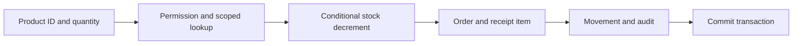
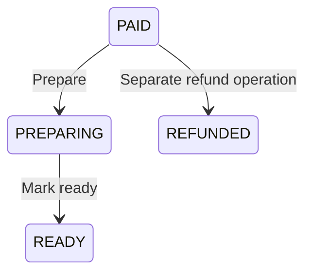

# Retail workflows and data integrity

[Documentation index](README.md)

The principal implementation is [RetailService](../apps/api/src/retail/retail.service.ts), with the order state machine in [OrdersService](../apps/api/src/orders/orders.service.ts).

## Opening the workspace

`GET /api/bff/retail` exchanges the session for a JWT, checks `store.read` in Next and Nest, and selects only assigned stores in the actor's tenant and region. Each store contains its branch-product listings with catalog details, latest 50 orders with items, and latest 15 audit events. A second batched query computes refund capabilities.

Money is converted from Prisma Decimal to JSON numbers; timestamps serialize as strings. The dashboard response includes the actor and permissions. Store/product lists are not paginated. The included orders and capability query are separate reads, so they are not guaranteed to represent one database snapshot. Execution-time checks remain necessary.

## Recording a sale

The client sends only a branch-product ID and quantity:

```json
{ "storeProductId": "10-coffee", "quantity": 2 }
```

Next and Nest check the trusted origin. Next exchanges the opaque cookie and checks `order.create`; Nest verifies the bearer JWT and active session. The DTO requires a product ID of 1–100 characters and integer quantity 1–1000. The service requires `order.create` and opens a transaction:

1. Find the branch-product in an authorized store, with `isAvailable = true`, and an active product belonging to the tenant.
2. Read price and product name from the database.
3. Atomically decrement stock only if stock is sufficient, price still equals the read price, availability remains true, and store scope still matches.
4. If exactly one row was not changed, throw a 400 conflict-style message; no sale records commit.
5. Create an Order with a random UUID, PAID status, `walk-in` customer, and server-calculated Decimal total.
6. Create its OrderItem with quantity, unit price, product ID, and product-name snapshot.
7. Append a negative InventoryMovement with a sale reference and an AuditEvent with the actor.
8. Commit everything and return the order ID.



At THB 85 per coffee, quantity 2 produces a total of THB 170. Editing browser state cannot select another price. The request never accepts a total.

### Concurrent buyers

If one unit remains and two sales compete, only one conditional decrement can satisfy `stock >= 1`. The other request receives a 400. The SQL nonnegative-stock check is an additional safeguard for all writers.

A transaction does not make a repeated HTTP request idempotent. If a sale commits but the response is lost, retrying can create a second sale when stock remains. There is no idempotency key or stored request result.

## Adjusting stock

`POST /api/bff/retail/inventory/:id/adjust` requires `inventory.adjust` at both server layers, a nonzero integer delta from -10000 to 10000, and a reason string of 3–120 characters. The service rejects a whitespace-only reason and stores its trimmed form. The DTO's length check happens before trimming, so it does not guarantee three meaningful characters.

Within one transaction, the service finds the scoped listing, increments stock conditionally, writes the movement, and writes the audit event. For a negative delta, stock must cover the absolute decrement. Insufficient stock produces 400; an unavailable scoped listing produces 403.

This is a stock correction workflow, not a purchasing/receiving system. There are no supplier, shipment, lot, warehouse-transfer, reservation, or cost-of-goods entities.

## Preparing an order

The allowed lifecycle is:



`PATCH /api/bff/orders/:id` requires `order.update_status` at both server layers and an assigned branch. The status DTO accepts the OrderStatus enum, including REFUNDED, but the service allows only PAID → PREPARING and PREPARING → READY. A PATCH cannot perform a refund or skip directly from PAID to READY.

The update predicate includes the previous status. A competing transition that wins first causes the later update to affect zero rows and return 403. READY and REFUNDED are terminal in this implementation. Status changes do not create audit events or stock movements.

## Refunding an order

The [shared policy](04-authorization-and-capabilities.md) requires permission, scope, PAID state, and a total within the actor's limit. An atomic update changes the status to REFUNDED. A repeat request fails with 403 because the order is no longer PAID.

This operation has no payment-provider call, refund record, reason, amount, partial refund, inventory return, or audit event. A sale refunded in this demo remains deducted from stock. The UI excludes it from the recent-sales total, but that is not accounting reconciliation.

## Which invariants hold where

- **Database constraints:** unique tenant SKU; unique branch/product listing; positive item quantity; nonnegative listing stock and prices; nonzero movement delta; declared foreign keys.
- **Atomic predicates:** sufficient stock at decrement; unchanged branch price at sale; eligible status at transition/refund.
- **Transactions:** sale and adjustment stock/history/audit writes commit together.
- **Application rules:** tenant/region consistency, assigned branch, role grants, sale total calculation, and the order state machine.
- **Not enforced globally:** total equals the sum of items; every order has items; stock equals movement sum; tenant consistency across related records; append-only audit history.

Legacy seeded orders intentionally demonstrate some of these differences. Administrative SQL or new writers must preserve application invariants explicitly. JWT/session verification also precedes the service transaction, so an already-running request may finish after a grant is revoked.

## Failure and recovery

Known eligibility failures become 400 or 403. Database errors such as connection failure, integer overflow, or unexpected constraint violations have no retail-specific translation/retry layer and can become server errors. A transaction failure rolls back its own writes; the caller still needs to distinguish a definite rejection from a lost response after commit.

There is no background worker, outbox, event bus, webhook consumer, or automated reconciliation job. Introducing external side effects requires a recovery design beyond the existing local transaction.
