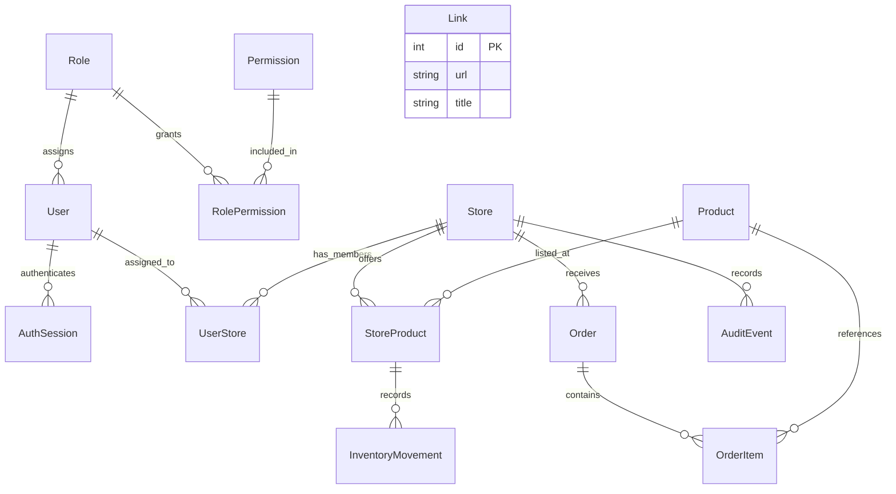

# Database schema and relationships

[Documentation index](README.md)

## Authoritative definitions

Read the [Prisma schema](../packages/prisma/prisma/schema.prisma) together with the [migration history](../packages/prisma/prisma/migrations). The schema contains 14 models and two enums. PostgreSQL is the persistence engine. [prisma.config.ts](../packages/prisma/prisma.config.ts) supplies the connection configuration, and the [shared client](../packages/prisma/src/index.ts) uses the PostgreSQL adapter and pool.

Prisma model/field names are camel/Pascal case; most SQL names use snake case through `@map` and `@@map`. The legacy Link timestamps retain camel-case SQL names. Below, fields are required unless marked nullable. Relation arrays are ORM navigation properties, not extra database columns.

## Entity relationship diagram

Link is an isolated template entity. Customer IDs, tenant IDs, and AuditEvent.actorId are plain strings; the diagram deliberately does not invent foreign-key relationships for them.

## Scalar conventions

- `String` maps to PostgreSQL TEXT here, including UUID-looking IDs. IDs are not PostgreSQL UUID columns.
- `Int` maps to INTEGER. Auto-increment IDs are database-generated; other IDs are supplied by code or Prisma defaults.
- Monetary values use `Decimal(12,2)`. Currency is not stored per record; the demo assumes/display-formats THB.
- DateTime columns use the migrations' `TIMESTAMP(3)` representation. JSON responses serialize dates as strings.
- `now()` supplies creation timestamps. `@updatedAt` is maintained by Prisma; arbitrary SQL updates do not automatically invoke an update trigger.
- `@default(uuid())` generates IDs through Prisma for OrderItem, InventoryMovement, and AuditEvent. Their migration columns have no SQL UUID default, so direct SQL writers must provide IDs.

## Identity and authorization models

### User → `users`

- `id: String`: primary key; seeded/mock provider subject.
- `name: String`: display name; session creation also compares it to mock identity data.
- `tenantId: String` → `tenant_id`; `region: String`: scope attributes.
- `refundLimit: Decimal(12,2)` → `refund_limit`, default 0.
- `customerId: String?` → `customer_id`: nullable customer ownership identifier, not a foreign key.
- `roleId: Int` → `role_id`: required Role foreign key.
- `createdAt: DateTime` → `created_at`, default now; `updatedAt: DateTime` → `updated_at`, Prisma-updated.

Relations: one Role, many assigned-store memberships, many sessions. Index: `tenantId`. There is no email, password, provider-issuer tuple, active flag, or multi-role relation.

### AuthSession → `auth_sessions`

- `id: Int`: auto-increment primary key.
- `tokenHash: String` → `token_hash`: unique SHA-256 session-token hash.
- `userId: String` → `user_id`: User foreign key.
- `expiresAt: DateTime` → `expires_at`: required expiry.
- `revokedAt: DateTime?` → `revoked_at`: nullable revocation timestamp.
- `createdAt: DateTime` → `created_at`, default now.

Composite index: `(userId, revokedAt, expiresAt)`. Deleting a user cascades to sessions. There is no raw session token, device record, refresh token, or provider token stored here.

### Role → `roles`

`id: Int` is an auto-increment primary key. `code: RoleCode` is unique. Relations connect users and permission grants.

RoleCode values: CUSTOMER, STORE_STAFF, STORE_MANAGER, HQ_ADMIN. They constrain role names; permission names remain extensible strings.

### Permission → `permissions`

`id: Int` is an auto-increment primary key. `code: String` is unique. The role-grant relation contains the roles receiving that permission.

### RolePermission → `role_permissions`

`roleId: Int` → `role_id` and `permissionId: Int` → `permission_id` are required foreign keys. Their pair is the composite primary key, preventing duplicate grants. Deleting either parent cascades to its junction rows.

### UserStore → `user_stores`

`userId: String` → `user_id` and `storeId: String` → `store_id` are required foreign keys. Their pair is the composite primary key. Deleting either parent cascades to membership rows. The schema does not ensure that the user's tenant and region match the store; runtime scope checks add those conditions.

## Retail models

### Store → `stores`

- `id: String`: primary key, supplied by seed/application.
- `tenantId: String` → `tenant_id`; `region: String`: scope attributes.
- `name: String`, default `Branch`; `address: String`, default empty string.

Index: `tenantId`. Relations: memberships, listings, orders, and audit events. No timestamps or separate tenant relation are present.

### Product → `products`

- `id: String`: supplied primary key.
- `tenantId: String` → `tenant_id`.
- `sku: String`, `name: String`, `category: String`.
- `active: Boolean`, default true.

Unique key: `(tenantId, sku)`. Relations: store listings and order items. SKU uniqueness is tenant-local. Current price and stock belong to StoreProduct, not Product. Category is a free string, not a Category table.

### StoreProduct → `store_products`

- `id: String`: supplied primary key; examples include `10-coffee`.
- `storeId: String` → `store_id`: Store foreign key.
- `productId: String` → `product_id`: Product foreign key.
- `price: Decimal(12,2)`: current branch price.
- `stock: Int`, default 0: authoritative current quantity on hand.
- `isAvailable: Boolean` → `is_available`, default true.

Unique key: `(storeId, productId)`. SQL CHECKs enforce `stock >= 0` and `price >= 0`. Relations connect the branch, catalog product, and stock movements. The two foreign keys do not themselves require both parents to belong to the same tenant.

### Order → `orders`

- `id: String`: supplied primary key; live sales use a UUID string, seed examples use numeric-looking strings.
- `tenantId: String` → `tenant_id`; `region: String`.
- `storeId: String` → `store_id`: Store foreign key.
- `customerId: String` → `customer_id`: required identifier; no Customer foreign key.
- `status: OrderStatus`: required, no schema default.
- `total: Decimal(12,2)`: required, no schema default or nonnegative SQL CHECK.
- `createdAt: DateTime` → `created_at`, default now; `updatedAt: DateTime` → `updated_at`.

Indexes: `(tenantId, storeId)` and `(tenantId, customerId)`. Relation: zero or more items. OrderStatus values are PAID, PREPARING, READY, REFUNDED. The enum restricts possible values, not valid transitions. There is no database constraint that total equals the sum of items.

### OrderItem → `order_items`

- `id: String`: primary key, Prisma UUID default.
- `orderId: String` → `order_id`: Order foreign key.
- `productId: String` → `product_id`: Product foreign key.
- `quantity: Int`: SQL CHECK greater than zero.
- `unitPrice: Decimal(12,2)` → `unit_price`: SQL CHECK nonnegative.
- `productNameSnapshot: String` → `product_name_snapshot`: name when purchased.

Index: `orderId`. There is no unique `(orderId, productId)` constraint. The schema supports multiple lines, although the current sale endpoint creates one. Items reference Product rather than StoreProduct; order branch and receipt price supply the historical context.

### InventoryMovement → `inventory_movements`

- `id: String`: primary key, Prisma UUID default.
- `storeProductId: String` → `store_product_id`: listing foreign key.
- `quantityDelta: Int` → `quantity_delta`: SQL CHECK not equal to zero.
- `reason: String`: free-text explanation; sale references are embedded in this text.
- `createdAt: DateTime` → `created_at`, default now.

Index: `(storeProductId, createdAt)`. There is no dedicated actor/order foreign key, movement type enum, resulting-balance field, or reconciliation constraint. AuditEvent separately records actors for the implemented service writes.

### AuditEvent → `audit_events`

- `id: String`: primary key, Prisma UUID default.
- `storeId: String` → `store_id`: Store foreign key.
- `actorId: String` → `actor_id`: plain identifier, not a User foreign key.
- `action: String`: currently `order.create` or `inventory.adjust` for retail writes.
- `detail: String`: human-readable free text.
- `createdAt: DateTime` → `created_at`, default now.

Index: `(storeId, createdAt)`. This is an activity log, not a tamper-proof audit ledger. No trigger or database role policy makes it append-only.

### Link → `links`

- `id: Int`: auto-increment primary key.
- `url: String`, `title: String`, `description: String?`.
- `createdAt: DateTime`, default now; `updatedAt: DateTime`, Prisma-updated.

No foreign keys, tenant scope, or additional indexes. The template's public CRUD routes operate on this model independently of retail.

## Referential actions

The migrations use ON UPDATE CASCADE for foreign keys. Deletion cascades are declared for session ownership and the RolePermission/UserStore junctions. Other required parent relationships use RESTRICT, including orders to stores and retail history to its parents. Therefore deleting a store can still fail because of orders, listings, or audits even though its memberships would cascade.

There are no application routes for deleting retail entities. Future deletion workflows must deliberately preserve receipt/history requirements and account for these constraints.

## Migration history

1. `20260917000000_add_conditional_authorization`: base Link, identity/role/grant/membership/store/order model and enums.
2. `20260918000000_add_revocable_sessions`: hashed, expiring, revocable AuthSession records.
3. `20260919000000_add_retail_operations`: catalog, listings, receipt items, movements, audit events, store labels, indexes, foreign keys, and five CHECK constraints.

Apply committed migrations for a faithful database. `prisma db push` alone cannot reconstruct SQL-only business CHECKs from the Prisma model. A successful client generation also does not prove migrations ran.

## Important gaps in the data contract

Tenant equality across relations, nonempty orders, total/item agreement, stock/movement agreement, and valid state transitions are not database-wide guarantees. There are no Tenant, Customer, Payment, Refund, Promotion, Supplier, Transfer, or WebhookEvent models.

Before extending this model, distinguish historical snapshot fields from current facts, decide which invariants need database enforcement, and plan a migration/backfill for existing seeded orders with no items. See [risks](10-risks-and-limitations.md) and [improvements](11-improvement-roadmap.md).
