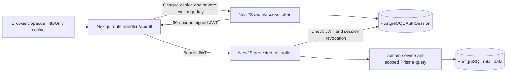

# BFF authentication and authorization architecture

[Documentation index](README.md)

## Request boundaries



The browser calls the Next.js same-origin BFF. It never receives the access JWT through a browser response or cookie. Next and Nest share [the authorization package](../packages/authorization/src/policy.ts); it has no database, Node, Nest, or Next dependency. The token format and Web Crypto signature functions live in the same package but are called only on the server with a secret.

## Login and cookie ownership

The application still uses the existing local mock authorization-code flow with state and PKCE. The browser-facing `/auth/login`, `/mock-provider/authorize`, and `/auth/callback` paths now run through [Next auth route handlers](../apps/web/app/auth/[...path]/route.ts) and the [auth proxy](../apps/web/lib/bff/auth-proxy.ts). Next forwards requests and Set-Cookie headers while Nest continues to create and validate state, codes, and sessions. The public callback URL is the configured `WEB_URL` (or `WEB_ORIGIN`). Nest redeems the mock code against its own `API_INTERNAL_URL`, avoiding a server-to-server round trip through the browser-facing Next origin.

The `oauth_attempt` and `app_session` cookies remain encrypted, HttpOnly, SameSite=Lax, and host scoped; Secure is added in production. `app_session` contains a random token and expiry, not a role. PostgreSQL stores only its hash in AuthSession. The browser sends this cookie to Next on same-origin requests.

The mock provider is still not proof of real identity. `NODE_ENV=production` disables it, and this repository has no production identity provider adapter.

## Each protected request

1. [clientFetch](../apps/web/lib/fetch/client.ts) calls `/api/bff` on the current origin. The [BFF route allowlist](../apps/web/lib/bff/route-policy.ts) maps method and path to an action permission; unknown routes return 404.
2. For writes, Next rejects an Origin that differs from the configured web origin. It forwards no browser-supplied Authorization header to Nest.
3. Next calls `POST /auth/access-token` at the private API address with the opaque cookie and a server-only exchange key derived from `AUTH_COOKIE_SECRET` for this purpose. The endpoint rejects callers without the exchange key before reading a session.
4. Nest loads the session and current user, role grants, and store assignments from PostgreSQL. It returns a signed HS256 JWT valid for 60 seconds. Claims include subject/user ID, session hash, tenant, region, role, permission strings, store IDs, customer ID, and refund limit. Issuer and audience are fixed and checked.
5. Next verifies JWT signature, structure, issuer, audience, and time limits. It calls shared `can()` for the route's named permission. A denied request stops at Next with 403.
6. Next forwards an allowed request to Nest with `Authorization: Bearer <JWT>` and a trusted Origin. It does not forward the opaque session cookie on protected retail/order calls.
7. Nest independently verifies the JWT and checks the referenced AuthSession row for expiry or revocation. Controllers/services apply shared `can()` again. Domain services keep tenant/region/customer/branch predicates, stock checks, order transitions, and refund limit/status checks in their existing database operations.

The BFF decides only what it can know from the signed snapshot and route. A branch-product ID or order ID is not assumed to encode a trustworthy store ID. Resource ownership and mutable business state remain authoritative in Nest/Prisma.

The existing Links scaffold remains public in Nest and is proxied as public by the BFF for compatibility. It is not a model for new protected routes. `GET /orders/access-summary` requires authentication but has no separate permission grant.

## Shared `can()`

```ts
can(auth, 'order.refund', { tenantId: 'thai-food', storeId: '10' });
```

`can()` checks the named permission and, when supplied, matching tenant and assigned store. It deliberately does not fetch an order, inspect status, compare a refund limit, or make network calls. The [refund policy](../apps/api/src/orders/refund.policy.ts) composes `can()` with a Prisma predicate for those mutable rules and uses that predicate for both read-time capabilities and the write.

Adding a new protected endpoint requires an explicit BFF allowlist entry and an independent Nest authorization decision. Adding a new permission requires the shared vocabulary, the database seed/administration grant, and tests for both layers.

## Revocation and staleness

A valid opaque session can obtain a fresh JWT on each BFF request. The session itself remains one hour and has no rolling renewal; it can only mint new access tokens until it expires or is revoked. Nest checks the session row again on each protected request, so a token from a revoked session is rejected even before its 60-second expiry.

Permissions and assignments are a snapshot in the JWT. Because the BFF exchanges on each request, normal browser calls get current database grants. A previously issued direct bearer token can retain an old grant until its 60-second expiry if the session remains active. Business predicates still check mutable order/stock state at execution. Revocation does not cancel a request already past its authorization check.

Logout and logout-all pass through Next, revoke PostgreSQL sessions in Nest, clear the browser cookie, and redirect. The BFF never treats a UI capability or client-provided role as authority.

## Network and configuration

- `WEB_URL`/`WEB_ORIGIN`: the browser-facing Next origin and trusted mutation Origin. Keep them aligned. Public auth redirects use this origin.
- `API_INTERNAL_URL`: server-to-server Nest address. It defaults to `http://localhost:${API_PORT || 3001}` for the local monorepo. It must be reachable by the Next server and by Nest's mock-code exchange; it must not be supplied to browser code.
- `AUTH_COOKIE_SECRET`: at least 32 decoded random bytes. Both server processes need the same value to derive separate access-token and internal-exchange keys. It is never a Next public environment variable.
- `API_PORT`: Nest listener port. Browser fetches no longer use `NEXT_PUBLIC_API` or `API_PUBLIC_URL`; those remain in older local setups/template scripts but are not the protected path.

Nest no longer enables credentialed browser CORS. Protect the internal API with deployment network policy as well; the exchange key and JWT/session checks are application defenses, not a substitute for network isolation. Next route handlers use no-store responses for protected data. The BFF uses an explicit route list rather than an open proxy.

## Tests and limits

The API tests cover exchange-key denial, JWT signature/expiry, permission checks, and database revocation. Web tests cover route mapping. The local [retail integration script](../scripts/test-retail.mjs) follows the proxied mock login, exercises the BFF, checks that a direct cookie-only Nest request fails, and confirms direct bearer calls are independently authorized. It mutates an isolated demo database; see [development and verification](09-development-and-verification.md).

The architecture is still a demonstration: mock identity, process-local code consumption, no key rotation, no token replay registry, no rate limiting, and public Links scaffold remain. Exchanging on every BFF request adds a PostgreSQL read; measure this before introducing caching, since cache freshness affects revocation and grant changes.
